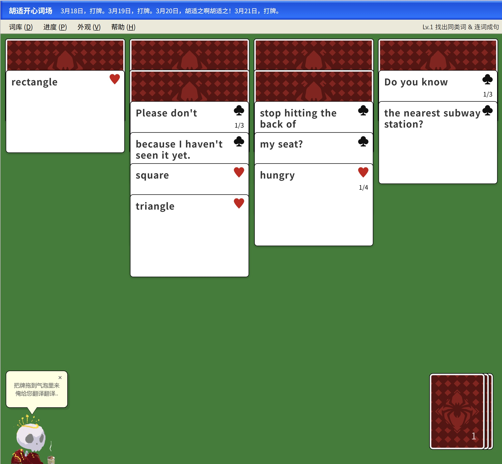

# 胡适开心词场 · Hushi Anki

> 7月13日，打牌。
> 7月14日，打牌。
> 7月15日，打牌。  
> 7月16日，胡适之啊胡适之！你怎么能如此堕落！不能再这样下去了！  
> 7月17日，打牌。7月18日，打牌。  
> ——《胡适日记》

这是一个网页游戏。你可以在这里用蜘蛛纸牌 / 空档接龙的方式背单词。或者任何你想背诵的东西。

[🚀 点击即玩 - 胡适开心词场 · Hushi Anki](https://ninefourpark.github.io/HushiAnki/)



## 核心规则

- 把“能组成一组的牌”放在一起。
- 当一整组牌被正确排好，它会自动消除。
- 清空桌面上所有的牌，则本局胜利。
- 程序会自动安排下次复习的时间。

## 四种卡牌

| 类型 | 玩法 | 示例 |
|------|------|------|
| 同类词 | 把同类词归在一起 | `#Fruit: apple, banana, orange` |
| 连词成句 | 把句子碎片按顺序叠好 | `I'd like` → `a hot` → `latte.` |
| 程度排序 | 从弱到强排列 | `Good` → `Great` → `Amazing` |
| 对话链 | 补完一段对话 | `Can I help you?` → `Yes, I'm looking for a shirt.` → `What size?` |


---

## 添加自己的词库

在菜单「词库 → 新建词库 → 打开编辑器」里，用**蜘蛛语法**写好内容粘贴进去：
```
@title: 雅思核心词汇
@language: en
@tags: IELTS, Academic

I'd like + a hot + latte.
Good > Great > Amazing
Can I help you? // Yes, I need a coat. // What size?
#Fruit: apple, banana, orange
```

| 符号 | 卡牌类型 |
|------|----------|
| `+` | 连词成句 |
| `>` | 程度排序 |
| `//` | 对话链 |
| `#组名:` | 同类词 |

支持全角符号（`＋` `＞` `／／` `＃`），日文输入法下也能写。

### 分享词库

「词库 → 导出当前词库」或「词库 → 复制当前词库到剪贴板」
粘贴到 Craft、Notion都行，对方再粘贴进词库编辑器就能导入。


## 记忆曲线

答对一组，间隔拉长；积累 7 次后这组牌正式「毕业」，不再出现。
```
同天 → +1天 → +2天 → +4天 → +7天 → +15天 → +30天 → 毕业
```

长时间没打开游戏也没关系——逾期的牌会自动优先出现，  

进度存在浏览器的 localStorage 里，不需要账号。  
建议定期在「进度 → 导出学习进度」「词库 → 导出当前词库」备份。

## 致谢

### 界面设计

UI 风格模仿 Windows XP。
视觉参考了 [nielssp/classic-stylesheets](https://github.com/nielssp/classic-stylesheets)（Niels Poulsen，MIT License）。

### 第三方服务

翻译功能由 [MyMemory 翻译 API](https://mymemory.translated.net/doc/spec.php) 提供支持。

